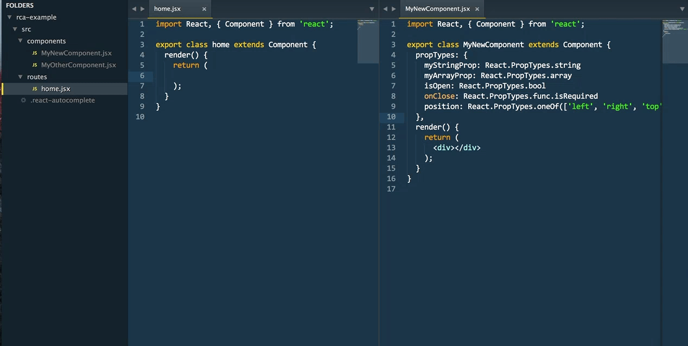
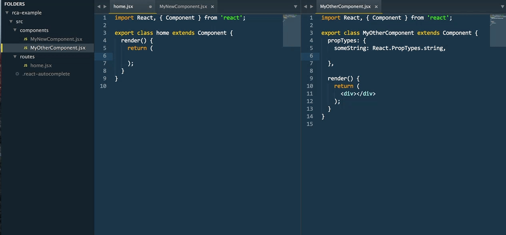
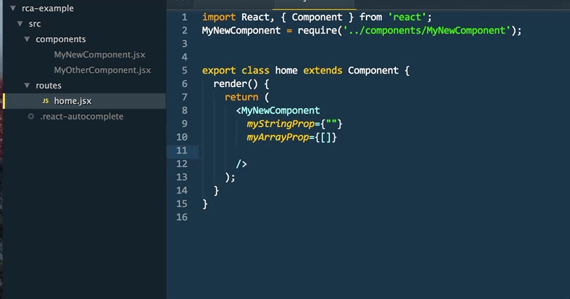

# React Component Autocomplete
Autocomplete plugin for your own react components.

## Overview

This sublime package autocompletes your react components.
When you start typing `<ComponentName...` it searches a specified folder in the project and suggests existing components with their props.
Once you select a component, it also automatically appends a `require` statement after last existing require, or at the top of the file.

## Getting started
### Automatic Installation
Coming soon.

### Manual Install
You can clone this repository to the Packages directory of your Sublime installation. In Mac OS Terminal, run:

```
cd ~/Library/Application\ Support/Sublime\ Text\ 3/Packages/
git clone git@github.com:pepahlavacek/react-component-autocomplete-sublime.git ReactComponentAutocomplete
```

### Setting up your project

**You need to do this in order to use RCAutocomplete in your project**

Add a file called `.react-autocomplete` to your project's root folder.
This file should contain just one line with a path to the component folder within that project.

In Terminal, you can run something like this:
```
cd my/project/folder
echo "src/scripts/components" > .react-autocomplete
```

Where `src/scripts/components` is a relative path to the folder with autocompleted components.

Or you can just add the file manually.

```
# .react-autocomplete
src/scripts/components
```

## Usage
**Component Autocompletion**: When inside component opening tag (`<`) suggestions will appear. Those are all files inside the folder defined in `.react-autocomplete` and its subfolders.



**Live Reload**: Whenever you update props on a component, they will immediately get registered and they'll show up in autocompleted components.



**Prop Suggestions**: When you start typing inside an existing component, prop suggestions will show up.




## Contributing
This plugin is work in progress and any help is appreciated. Feel free to add an issue if you find a bug, or just fork and open a new PR with a fix or an improvement.

## To Do
- [x] Use relative path in `require` statements
- [x] Replace any file extension in `require` statements, not just `cjsx`
- [x] Parse jsx and js components
- [x] ~~Allow specifying file (output) format in settings file~~ Use file syntax based on settings
- [x] Clean up and deduplicate tests, make imports work there
- [x] Take indentation settings in consideration (2 vs 4 spaces)
- [x] Allow underscore in propTypes
- [x] Add more tests
- [x] Output nicer default props than commented prop types
- [x] Parse instanceOf, arrayOf, oneOf, oneOfType with at least some confidence (add tests)
- [x] Ignore comments on prop lines
- [x] Parse ImmutablePropTypes (or any custom ones) as they come (don't mess up the names)
- [ ] Start versioning
- [x] Add gifs with usage
- [x] Write docs (Readme)
- [x] Add contribution section
- [ ] Get it ready for package control
